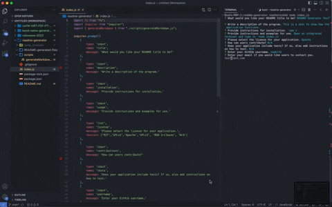

# README Generator

## Description

This application uses Node.js to create a user's README file in the terminal. The user will be prompted with questions, and their inputed answers will then fill in the README file data.

## Table of Contents

- [Installation](#installation)
- [Usage](#usage)
- [Screenshot](#screenshot)
- [Video Walkthrough](#video-walkthrough)

## Installation 

Clone or Fork the repository to your computer. Enter `npm i` to install dependancies.

## Usage

- Open an integrated terminal from your project folder.
- Type `node index.js` into the terminal.
- Answer each prompt that follows.

## Screenshot

## Video Walkthrough

[Link to Walkthrough](https://watch.screencastify.com/v/upaLuS5F0REWzZjF8GYD)

